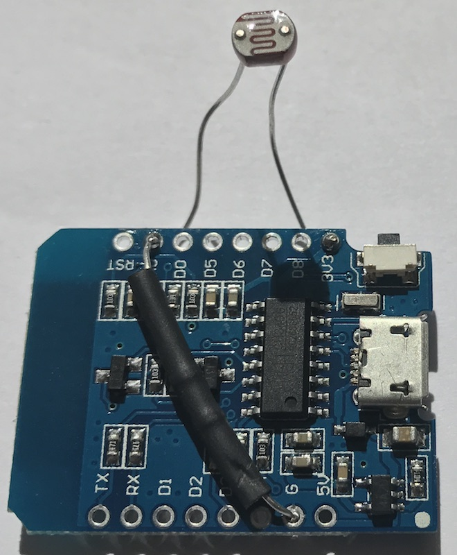
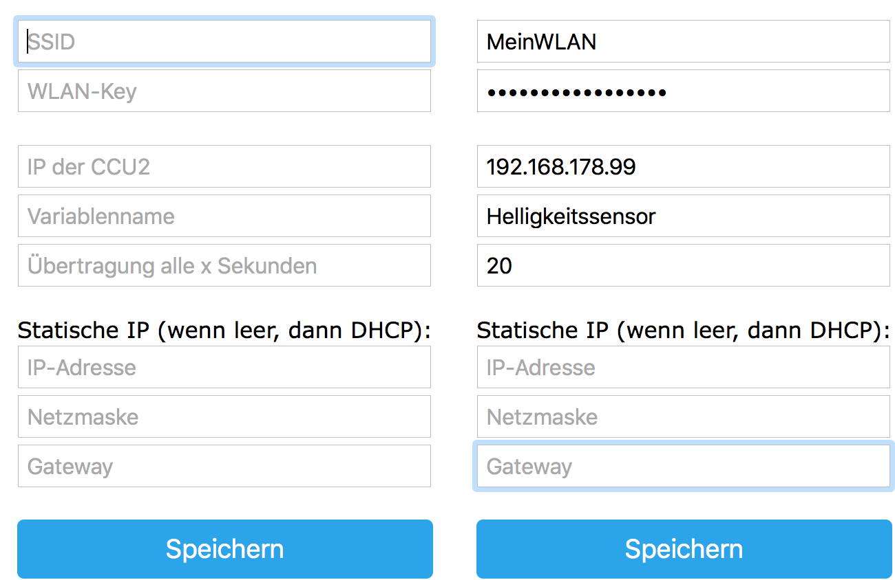

# WemosD1 HomeMatic Helligkeitssensor

## Zusammenfassung:
Der Sensor übermittelt in einem konfigurierbaren Intervall den Helligkeitswert (ca. 0...1023) an eine Variable der CCU2.
_(Genauere Werte sind mit einer Photodiode statt eines Photowiderstands (LDR) erreichbar, jedoch hatte ich zum Zeitpunkt des Projekts noch einige LDR zu liegen...)_

Bei Tests in absoluter Dunkelheit lag der Wert bei ca. 7, in praller Sonne bei ca. 1000.

## Teileliste:
- 1x [Wemos D1 mini](http://www.ebay.de/itm/272271662681) (ca. 3,29 EUR)
- 1x Stromversorgungsmodul, z.B. [HLK-PM01](http://www.ebay.de/itm/272521453807) (ca. 2,34 EUR) - oder ein 5V Netzteil mit microUSB
- 1x [LDR](http://www.ebay.de/itm/321957950526) (ca. 2,75 EUR / 20 Stück = 0,14 EUR/Stk.)
- 1x [Widerstand 10k](http://www.ebay.de/itm/221833069520) (ca. 1,49 EUR / 10 Stück = 0,15 EUR/Stk.)
- 1x [Taster](http://www.ebay.de/itm/263057910534), wird jedoch nur zur (Erst-)Konfiguration benötigt
(_statt des Tasters kann man auch mit einer temporären Drahtbrücke arbeiten_) 

Die reinen Teilekosten liegen (ohne Gehäuse, div. Kleinkram :) und Anschlusskabel) somit bei ca. 6,- EUR.

## Verdrahtung:

**(Verdrahtung)**

**(Beispielaufbau (ohne Taster!))**

## Vorbereitung an der CCU
In der WebUI unter Einstellungen->Systemvariable ist eine Variable vom Typ Zahl anzulegen.
Beim Klick auf den Button 'Neu' öffnet sich ein Fenster zum Anlegen der Variable.

**(Anlegen einer Variable in der WebUI)**

## Konfiguration des Wemos D1
Um den Konfigurationsmodus zu starten, muss der Wemos D1 **mit gedrückt gehaltenem Taster gestartet** werden.
Die **blaue LED am Wifi-Modul blinkt kurz und leuchtet dann dauerhaft.**

**Der Konfigurationsmodus ist nun aktiv.**

Auf dem Handy oder Notebook sucht man nun nach neuen WLAN Netzen in der Umgebung. 

Es erscheint ein neues WLAN mit dem Namen "WemosD1-xx:xx:xx:xx:xx:xx"

Nachdem man sich mit diesem verbunden hat, öffnet sich automatisch das Konfigurationsportal.

Geschieht dies nicht automatisch nach ca. 10 Sekunden, ist im Browser die Seite http://192.168.4.1 aufzurufen.

**WLAN konfigurieren auswählen**

**SSID**: WLAN aus der Liste oben auswählen, oder SSID manuell eingeben

**WLAN-Key**: WLAN Passwort

**IP der CCU2**: IP-Adresse der CCU2

**Variablenname**: Name der Variable, die zuvor in der CCU2 angelegt wurde

**Übertragung alle x Sekunden**: Sende-Intervall

 

**(Konfiguration leer / Beispiel)**

