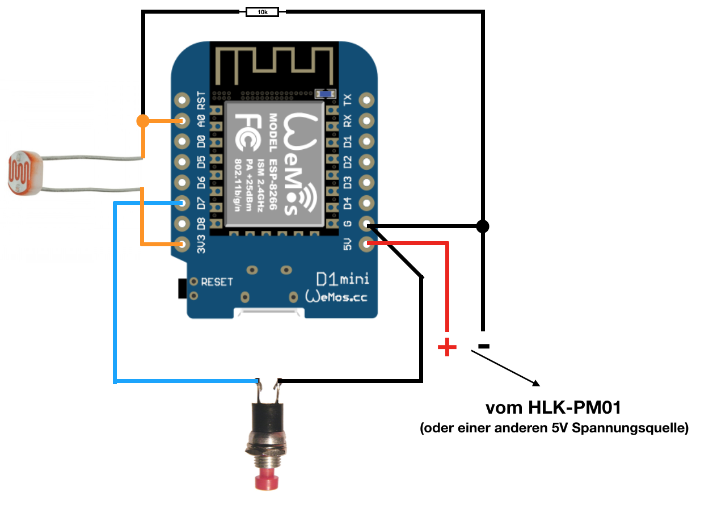
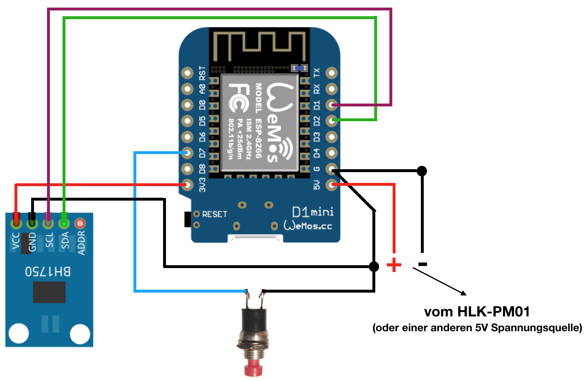
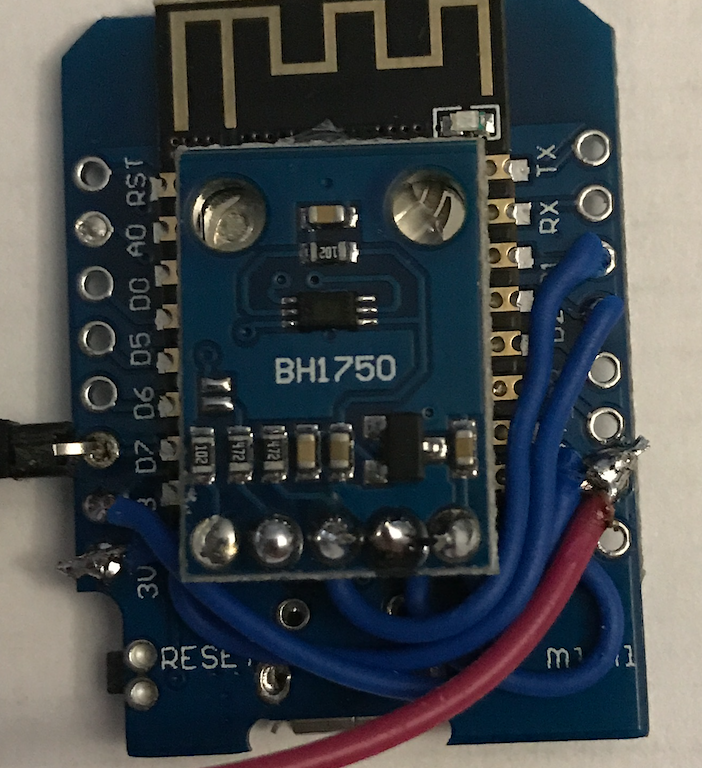

# WemosD1 HomeMatic Helligkeitssensor

## Zusammenfassung:
Es sind hier 2 verschiedene Möglichkeiten des Aufbaus beschrieben.
Entweder mit einem Photowiderstand oder einem I2C Sensor BH1750.
_(Genauere Werte sind mit einem BH1750 Helligkeitssensor (liefert Lux) statt des einfachen Photowiderstands (LDR) erreichbar.)_

Der Sensor übermittelt in einem konfigurierbaren Intervall den Helligkeitswert 
 - bei Verwendung eines Photowiderstands (LDR) in einem Bereich von 0...1023
 - bei Verwendung eines Lichtsensors BH1750 in einem Bereich von 0...65535 Lux
an eine Variable der CCU2.


## Teileliste:
- 1x [Wemos D1 mini](http://www.ebay.de/itm/272271662681) (ca. 3,29 EUR)
- 1x Stromversorgungsmodul, z.B. [HLK-PM01](http://www.ebay.de/itm/272521453807) (ca. 2,34 EUR) - oder ein 5V Netzteil mit microUSB
- Lichtsensor:
  - entweder: 1x [LDR](http://www.ebay.de/itm/321957950526) (ca. 2,75 EUR / 20 Stück = 0,14 EUR/Stk.)
    - und 1x [Widerstand 10k](http://www.ebay.de/itm/221833069520) (ca. 1,49 EUR / 10 Stück = 0,15 EUR/Stk.)
  - oder: 1x [BH1750](http://www.ebay.de/itm/172461111764) (ca. 2,29 EUR)
- 1x [Taster](http://www.ebay.de/itm/263057910534), wird jedoch nur zur (Erst-)Konfiguration benötigt
(_statt des Tasters kann man auch mit einer temporären Drahtbrücke arbeiten_) 

Die reinen Teilekosten liegen (ohne Gehäuse, div. Kleinkram :) und Anschlusskabel) somit bei ca. 6 bis 8 EUR.

## Verdrahtung:


**(Verdrahtung mit LDR)**



**(Verdrahtung mit BH1750)**


**(Beispielaufbau mit LDR (ohne Taster!))**



**(Beispielaufbau mit BH1750 (ohne Taster!))**

## Flashen
Wenn alles nach obigem Bild verdrahtet wurde, kann das Image ```WemosD1_HomeMatic_Helligkeitssensor.ino.d1_mini.bin``` auf den Wemos geflasht werden.

#### Vorgehensweise:
1. Voraussetzungen:
  - CH340-Treiber installieren ([Download-Seite des Herstellers](https://wiki.wemos.cc/downloads))
  - Kommandozeilentool [esptool](https://github.com/igrr/esptool-ck/releases) herunterladen (Windows, Linux Mac) 
  - oder grafisches Tool [ESP8266Flasher](https://esp8266.ru/download/esp8266-utils/esp8266_flasher.zip) herunterladen und entpacken (Windows)
2. Die Dateien esptool.exe und WemosD1_HomeMatic_Helligkeitssensor.ino.d1_mini.bin am besten in einem gemeinsamen Verzeichnis ablegen
3. WemosD1 mit einem microUSB-Kabel an den PC anschließen
4. Bezeichnung des neuen COM-Ports im Gerätemanager notieren (z.B. COM5)
5. a) Flash-Vorgang durchführen (mit ESP8266Flasher):
    - esp8266_flasher.exe mit Doppelklick starten
    - auf den Button "Bin" klicken und heruntergeladene ```WemosD1_HomeMatic_Helligkeitssensor.ino.d1_mini.bin``` auswählen
    - ```COM1``` auf den unter 4. ermittelten COM-Port ändern
    - Download anklicken
5. b) Flash-Vorgang durchführen (mit esptool auf Kommandozeile): 
    - (Windows) Eingabeaufforderung öffnen
    - ins Verzeichnis von esptool/WemosD1_HomeMatic_Helligkeitssensor.ino.d1_mini.bin wechseln (cd c:\... usw.)
    - anschließend Flash-Vorgang starten mit
  
```esptool.exe -vv -cd nodemcu -cb 921600 -cp COM5 -ca 0x00000 -cf WemosD1_HomeMatic_Helligkeitssensor.ino.d1_mini.bin```


## Vorbereitung an der CCU
In der WebUI unter Einstellungen->Systemvariable ist eine Variable vom Typ Zahl anzulegen.
Beim Klick auf den Button 'Neu' öffnet sich ein Fenster zum Anlegen der Variable.


**(Anlegen einer Variable in der WebUI)**

## Konfiguration des Wemos D1
Um den Konfigurationsmodus zu starten, muss der Wemos D1 **mit gedrückt gehaltenem Taster gestartet** werden.
Die **blaue LED am Wifi-Modul blinkt kurz und leuchtet dann dauerhaft.**

**Der Konfigurationsmodus ist nun aktiv.**

Auf dem Handy oder Notebook sucht man nun nach neuen WLAN Netzen in der Umgebung. 

Es erscheint ein neues WLAN mit dem Namen "WemosD1-xx:xx:xx:xx:xx:xx"

Nachdem man sich mit diesem verbunden hat, öffnet sich automatisch das Konfigurationsportal.

Geschieht dies nicht automatisch nach ca. 10 Sekunden, ist im Browser die Seite http://192.168.4.1 aufzurufen.

**WLAN konfigurieren auswählen**

**SSID**: WLAN aus der Liste oben auswählen, oder SSID manuell eingeben

**WLAN-Key**: WLAN Passwort

**IP der CCU2**: IP-Adresse der CCU2

**Variablenname**: Name der Variable, die zuvor in der CCU2 angelegt wurde

**Übertragung alle x Sekunden**: Sende-Intervall

 


**(Konfiguration leer / Beispiel)**

